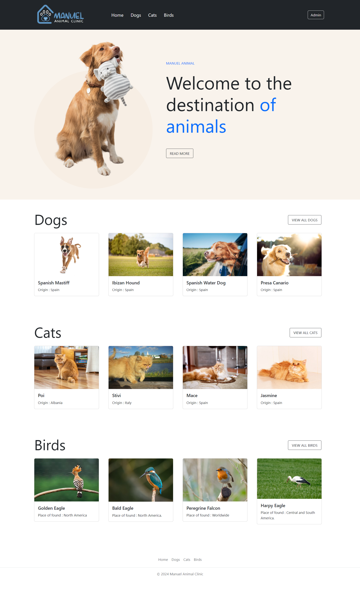
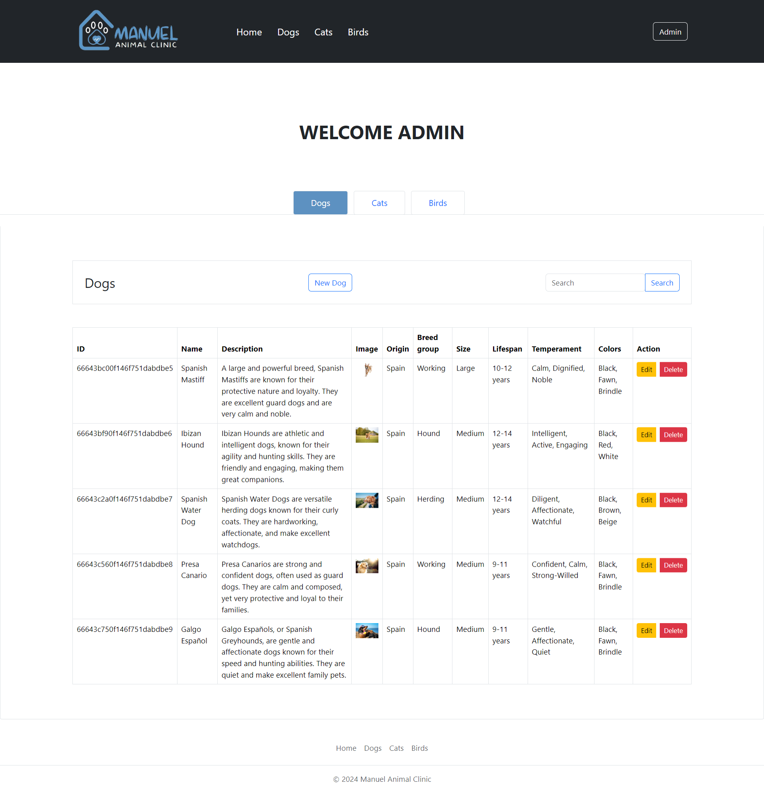

# AnimalCatalogClient

## Overview
This repository contains the frontend code for the Animal Catalog application. It is built using Angular framework and provides a user-friendly interface for managing animal data.

## Technologies Used
- **Framework**: Angular

## Getting Started
To get started with the frontend development environment, follow these steps:

1. **Clone the Repository:**
   ```bash
   git clone https://github.com/username/animal-catalog-client.git
   cd animal-catalog-client
Install Dependencies and Run the Application:

Install dependencies:
bash
Copy code
npm install
Start the Angular application:
bash
Copy code
ng serve
Access the Application:

Once the application is running, open a browser and go to http://localhost:4200 to access the frontend.

**Screenshots**

**Home Page**




**Admin Page**

Add New Animal / Edit Animal / Delete Animal




Contact
If you have any questions or suggestions regarding the frontend code, feel free to contact us at manuelzela30@gmail.com . 
